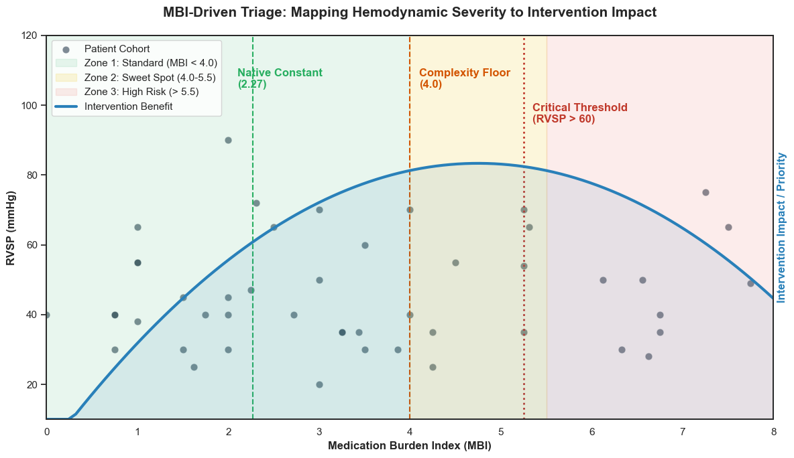

# Quantifying Clinical Gaps in Valvular Heart Disease: Using the Medication Burden Index (MBI) to Triage High-Complexity Intervention Candidates.
## 📄 Executive summary

|Section|Content
|:---|:---|
|**Context**|International Cardiology mission phase 1 (2025 cohort) analysis of Valvular Heart Disease in León, Nicaragua|
| **Challenge** | In this "clinical sprint," cardiologists often skip fields for healthy valves. If a valve is normal, the entry is left blank to save time. This creates Missing Not At Random (MNAR) bias. |
| **Strategy** | Natural Normal Imputation: Gaussian noise centered around healthy means (e.g., RVSP $25 \pm 4 \text{ mmHg}$) to the statistical variance of a healthy population. |
| **Key metric** | Medication Burden Index (MBI): A quantitative surrogate for clinical complexity and pulmonary hypertension based on pharmacological intensity. |
| **Outcome** | MBI-based triage proposal for identification of complex and high risk patients. |

## 📊 Outcome: MBI-driven triage
The MBI score serves as a robust proxy for anatomical complexity and critical hemodynamic compromise (AUC: 0.82).



Based on the cohort analysis ($N=152$), these thresholds guide the intake staff in prioritizing patients.

| MBI Range | Triage Zone | Clinical Interpretation |
|:---|:---|:---|
| **< 4.0** | **Zone 1: Stable** | Likely compensated. |
| **4.0 - 5.25** | **Zone 2: Sweet Spot** | High likelihood of complex mixed-lesion phenotypes. |
| **5.25 - 5.5** | **Zone 3: Critical** | **85% Precision** for Critical Pulmonary Hypertension ($RVSP > 60 mmHg$). |
| **> 5.5** | Zone 4: Palliative | Pharmacological exhaustion; risk of intervention futility. |

## 💻 Technical structure
### 📂 Project Schema
```text
.
├── data/
│   ├── raw/                                    # Original CSV
│   └── processed/                              # Post-Transformation data
├── notebooks/
│   ├── 01_extraction_transformation.ipynb      # Extraction & Transformation
│   ├── 02_loading.ipynb                        # MySQL connector script
│   └── 03_analysis.ipynb                       # Data Analysis
├── sql/                                        # .sql scripts for database queries
├── tableau/                                    # Tableau files
├── requirements.txt                            # Python library dependencies
└── README.md
```

## 📈 Data analysis
### 💊 The Medication Burden Index (MBI)
The MBI transforms fragmented medication lists into a single, actionable score that serves as a proxy for structural heart disease severity. By calculating the ratio of **Total Daily Dose (TDD)** against **Maximum Clinical Doses**, the model identifies high-complexity candidates before they reach the echocardiography suite.

### Mathematical Framework
$$MBI = \sum \left( \text{Class Weight} \times \frac{\text{Total Daily Dose}}{\text{Maximum Clinical Dose}} \right)$$